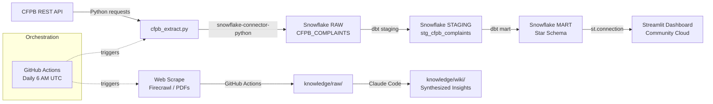
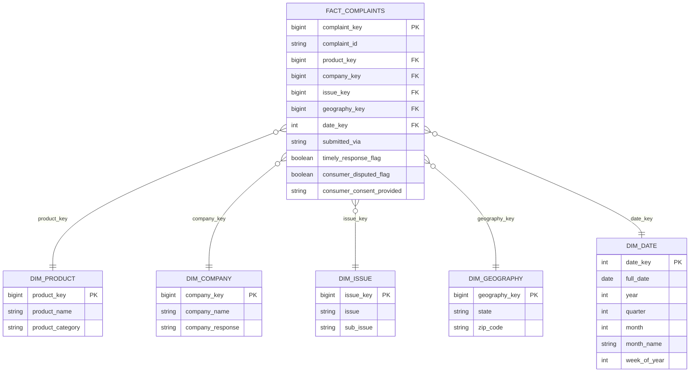

# Fintech Consumer Analytics

This project analyzes 4M+ consumer financial complaints from the CFPB Consumer Complaint Database to surface trust and quality signals across fintech products and companies. Using a fully automated pipeline — CFPB REST API → Snowflake → dbt star schema → Streamlit — it answers two questions: which fintech products generate the most consumer complaints, and why are consumers disputing company resolutions? Insights are designed to mirror the competitive intelligence work of a Marketing Science analyst at a consumer fintech company.

## Job Posting

- **Role:** Associate Data Analyst (Remote Friendly)
- **Company:** Greenlight Financial Technology
- **Link:** https://www.indeed.com/viewjob?jk=62e1919e54216338

This project demonstrates the core skills the role requires: SQL-heavy analysis, dbt dimensional modeling, automated data pipelines, dashboard development, and AI-assisted analytics workflows with Claude Code.

## Tech Stack

| Layer | Tool |
|---|---|
| Source 1 | CFPB Consumer Complaint Database (REST API) |
| Source 2 | Fintech industry sites, CFPB reports, press releases (web scrape) |
| Data Warehouse | Snowflake |
| Transformation | dbt |
| Orchestration | GitHub Actions |
| Dashboard | Streamlit |
| Knowledge Base | Claude Code (scrape → summarize → query) |

## Pipeline Diagram

## ERD (Star Schema)

## Dashboard Preview

## Key Insights

**Descriptive (what happened?):** Checking or savings account generates the most fintech complaints (212,760), with volume peaking in January 2025 at 70,316 — and 90% filed via web, signaling a digitally engaged consumer base that knows how to escalate.

**Diagnostic (why did it happen?):** Money transfer and virtual currency products have the lowest timely response rate (98.6%), lagging behind other categories — suggesting operational gaps in dispute handling for high-velocity digital payment products.

**Recommendation:** Fintech companies in payments and digital banking should invest in automated complaint triage → faster company response times reduce CFPB escalation risk and consumer churn.

## Live Dashboard

**URL:** https://fintech-analytics.streamlit.app/

## Knowledge Base

A Claude Code-curated wiki built from 15+ scraped sources across CFPB reports, fintech company sites, and industry analysis. Wiki pages live in `knowledge/wiki/`, raw sources in `knowledge/raw/`. Browse `knowledge/index.md` to see all pages.

**Query it:** Open Claude Code in this repo and ask questions like:

- What does my knowledge base say about why mobile banking apps generate consumer disputes?
- Which fintech companies have the worst complaint resolution track record?
- What regulatory trends from CFPB reports should a family fintech company watch?

Claude Code reads the wiki pages first and falls back to raw sources when needed. See `CLAUDE.md` for the query conventions.

## Setup & Reproduction

**Requirements:** Python 3.11+, Snowflake trial account (AWS US East 1), dbt Core, Streamlit.

Copy `.env.example` to `.env` and fill in your credentials:

    SNOWFLAKE_ACCOUNT=
    SNOWFLAKE_USER=
    SNOWFLAKE_PASSWORD=
    SNOWFLAKE_DATABASE=
    SNOWFLAKE_SCHEMA=
    SNOWFLAKE_WAREHOUSE=

**Steps:**

1. `pip install -r requirements.txt`
2. `python extract/cfpb_extract.py` — loads raw complaints to Snowflake
3. `cd dbt_project && dbt run && dbt test` — builds staging + mart models
4. `streamlit run dashboard/app.py` — runs dashboard locally

GitHub Actions runs the extraction pipeline daily at 6 AM UTC automatically.

## Repository Structure

    .
    ├── .github/workflows/    # GitHub Actions pipeline (extract + scrape)
    ├── extract/              # CFPB API extraction script
    ├── dbt_project/          # dbt models (staging + mart) and tests
    ├── dashboard/            # Streamlit app
    ├── knowledge/            # Knowledge base (raw sources + wiki pages)
    ├── docs/                 # Proposal, job posting, pipeline diagram, slides
    ├── .env.example          # Required environment variables
    ├── .gitignore
    ├── CLAUDE.md             # Project context for Claude Code
    └── README.md             # This file
