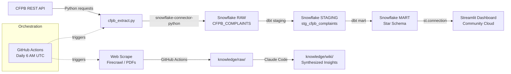

# Milestone 01 Implementation Plan

> **For agentic workers:** REQUIRED SUB-SKILL: Use superpowers:subagent-driven-development (recommended) or superpowers:executing-plans to implement this plan task-by-task. Steps use checkbox (`- [ ]`) syntax for tracking.

**Goal:** Build the full pipeline from CFPB REST API → Snowflake RAW → dbt staging + mart (star schema) → automated via GitHub Actions, with a pipeline diagram in README.

**Architecture:** Bottom-up — credentials and Snowflake schemas first, then extraction script tested locally against live Snowflake, then dbt models built against real data, then GitHub Actions workflow wired last. Every layer validates the previous one before moving on.

**Tech Stack:** Python 3.14, `snowflake-connector-python`, `requests`, `python-dotenv`, `pytest`, `dbt-core 1.11.8`, `dbt-snowflake 1.11.4`, GitHub Actions

---

## File Map

| File | Action | Purpose |
|---|---|---|
| `.env` | Create (gitignored, manual) | Local Snowflake credentials |
| `~/.dbt/profiles.yml` | Create (gitignored, manual) | dbt Snowflake connection |
| `extract/requirements.txt` | Create | Pinned Python dependencies |
| `extract/cfpb_extract.py` | Create | CFPB API → Snowflake RAW |
| `tests/test_cfpb_extract.py` | Create | Unit tests for parse + dedup logic |
| `dbt_project/dbt_project.yml` | Create | dbt project config |
| `dbt_project/macros/generate_schema_name.sql` | Create | Map `+schema` config to exact Snowflake schema names |
| `dbt_project/models/staging/sources.yml` | Create | dbt source declaration for RAW.CFPB_COMPLAINTS |
| `dbt_project/models/staging/stg_cfpb_complaints.sql` | Create | Clean, type-cast, deduplicate raw complaints |
| `dbt_project/models/staging/schema.yml` | Create | Staging model tests |
| `dbt_project/models/mart/dim_product.sql` | Create | Distinct product + sub-product dim |
| `dbt_project/models/mart/dim_company.sql` | Create | Distinct company dim with mode response |
| `dbt_project/models/mart/dim_issue.sql` | Create | Distinct issue + sub-issue dim |
| `dbt_project/models/mart/dim_geography.sql` | Create | Distinct state + zip dim |
| `dbt_project/models/mart/dim_date.sql` | Create | Date spine 2023-01-01 → today |
| `dbt_project/models/mart/fact_complaints.sql` | Create | One row per complaint, FK joins to all dims |
| `dbt_project/models/mart/schema.yml` | Create | Mart model tests |
| `.github/workflows/extract_cfpb.yml` | Create | Daily scheduled pipeline |
| `README.md` | Modify | Add Mermaid pipeline diagram |

---

## Task 1: Set Up Credentials and Snowflake Schemas

**Files:**
- Create: `.env` (gitignored — never committed)
- Create: `~/.dbt/profiles.yml` (gitignored — lives outside repo)

These are manual setup steps. No commit at end of this task.

- [ ] **Step 1: Create .env**

Copy `.env.example` to `.env` in the repo root, then fill in your Snowflake values:

```bash
cp .env.example .env
```

Open `.env` and set each variable. Your Snowflake account locator is in the format `xy12345.us-east-1` — find it at `app.snowflake.com` under your account menu → Account Details. Example filled-in file:

```
SNOWFLAKE_ACCOUNT=xy12345.us-east-1
SNOWFLAKE_USER=your_username
SNOWFLAKE_PASSWORD=your_password
SNOWFLAKE_DATABASE=FINTECH_ANALYTICS
SNOWFLAKE_SCHEMA=RAW
SNOWFLAKE_WAREHOUSE=COMPUTE_WH
SNOWFLAKE_ROLE=ACCOUNTADMIN
CFPB_API_BASE_URL=https://www.consumerfinance.gov/data-research/consumer-complaints/search/api/v1/
```

- [ ] **Step 2: Create Snowflake schemas**

Log into `app.snowflake.com`, open a new worksheet, and run this SQL:

```sql
CREATE DATABASE IF NOT EXISTS FINTECH_ANALYTICS;
CREATE SCHEMA IF NOT EXISTS FINTECH_ANALYTICS.RAW;
CREATE SCHEMA IF NOT EXISTS FINTECH_ANALYTICS.STAGING;
CREATE SCHEMA IF NOT EXISTS FINTECH_ANALYTICS.MART;
```

Expected: four green success messages. Verify in the left panel that `FINTECH_ANALYTICS` appears with three schemas under it.

- [ ] **Step 3: Create ~/.dbt/profiles.yml**

Run in terminal:

```bash
mkdir -p ~/.dbt
```

Then create `~/.dbt/profiles.yml` with this exact content (fill in your actual values — do not use env_var here, use literal strings):

```yaml
fintech_analytics:
  target: dev
  outputs:
    dev:
      type: snowflake
      account: xy12345.us-east-1
      user: your_username
      password: your_password
      database: FINTECH_ANALYTICS
      warehouse: COMPUTE_WH
      schema: RAW
      role: ACCOUNTADMIN
      threads: 4
```

- [ ] **Step 4: Verify dbt connection**

```bash
cd dbt_project
python -m dbt debug
```

Expected output ends with: `All checks passed!`

If `dbt_project/` doesn't exist yet, skip this step and return after Task 4.

---

## Task 2: Write Extraction Tests (Failing First)

**Files:**
- Create: `tests/__init__.py`
- Create: `tests/test_cfpb_extract.py`
- Create: `extract/__init__.py`
- Create: `extract/requirements.txt`

- [ ] **Step 1: Install dependencies**

```bash
pip install requests snowflake-connector-python python-dotenv pytest
```

Expected: packages install without error.

- [ ] **Step 2: Create extract/requirements.txt**

```
requests>=2.32
snowflake-connector-python>=3.10
python-dotenv>=1.0
```

- [ ] **Step 3: Create extract/__init__.py**

Empty file:

```bash
mkdir -p extract && touch extract/__init__.py
```

- [ ] **Step 4: Create tests/__init__.py**

```bash
mkdir -p tests && touch tests/__init__.py
```

- [ ] **Step 5: Write failing tests**

Create `tests/test_cfpb_extract.py`:

```python
from unittest.mock import MagicMock, patch


def test_parse_complaint_maps_all_fields():
    from extract.cfpb_extract import parse_complaint
    raw = {
        "complaint_id": "12345",
        "date_received": "2024-01-15",
        "product": "Checking or savings account",
        "sub_product": "Checking account",
        "issue": "Managing an account",
        "sub_issue": "Deposits and withdrawals",
        "company": "BANK OF AMERICA",
        "state": "CA",
        "zip_code": "90210",
        "submitted_via": "Web",
        "date_sent_to_company": "2024-01-16",
        "company_response_to_consumer": "Closed with explanation",
        "timely": "Yes",
        "consumer_disputed": "No",
        "consumer_consent_provided": "Consent provided",
    }
    result = parse_complaint(raw)
    assert result[0] == "12345"
    assert result[2] == "Checking or savings account"
    assert result[12] == "Yes"
    assert len(result) == 16


def test_parse_complaint_handles_missing_fields():
    from extract.cfpb_extract import parse_complaint
    raw = {"complaint_id": "99999"}
    result = parse_complaint(raw)
    assert result[0] == "99999"
    assert result[1] is None
    assert result[12] is None
    assert len(result) == 16


def test_dedup_filters_existing_ids():
    existing_ids = {"AAA", "BBB", "CCC"}
    raw_complaints = [
        {"complaint_id": "AAA"},
        {"complaint_id": "DDD"},
        {"complaint_id": "BBB"},
        {"complaint_id": "EEE"},
    ]
    new = [c for c in raw_complaints if c.get("complaint_id") not in existing_ids]
    assert len(new) == 2
    assert new[0]["complaint_id"] == "DDD"
    assert new[1]["complaint_id"] == "EEE"


@patch("extract.cfpb_extract.requests.get")
def test_fetch_stops_when_no_hits(mock_get):
    from extract.cfpb_extract import fetch_complaints
    mock_response = MagicMock()
    mock_response.json.return_value = {"hits": {"hits": []}}
    mock_get.return_value = mock_response
    result = fetch_complaints("2024-01-01", "2024-01-31")
    assert result == []
```

- [ ] **Step 6: Run tests — confirm they fail**

```bash
pytest tests/test_cfpb_extract.py -v
```

Expected: `ImportError: cannot import name 'parse_complaint' from 'extract.cfpb_extract'` (or `ModuleNotFoundError`). This is correct — the module doesn't exist yet.

---

## Task 3: Implement cfpb_extract.py

**Files:**
- Create: `extract/cfpb_extract.py`

- [ ] **Step 1: Write cfpb_extract.py**

```python
"""CFPB Consumer Complaint API extractor → Snowflake RAW.CFPB_COMPLAINTS."""

import logging
import os
from datetime import date, datetime
from typing import Optional

import requests
import snowflake.connector
from dotenv import load_dotenv

load_dotenv()

logging.basicConfig(level=logging.INFO, format="%(asctime)s %(levelname)s %(message)s")
log = logging.getLogger(__name__)

CFPB_API_URL = (
    "https://www.consumerfinance.gov/data-research/consumer-complaints/search/api/v1/"
)
PRODUCTS = [
    "Checking or savings account",
    "Credit card or prepaid card",
    "Money transfer, virtual currency, or money service",
    "Mortgage",
]
BACKFILL_START = "2023-01-01"
PAGE_SIZE = 10_000


def get_snowflake_connection():
    return snowflake.connector.connect(
        account=os.environ["SNOWFLAKE_ACCOUNT"],
        user=os.environ["SNOWFLAKE_USER"],
        password=os.environ["SNOWFLAKE_PASSWORD"],
        database=os.environ.get("SNOWFLAKE_DATABASE", "FINTECH_ANALYTICS"),
        warehouse=os.environ.get("SNOWFLAKE_WAREHOUSE", "COMPUTE_WH"),
        schema="RAW",
    )


def ensure_table(conn) -> None:
    conn.cursor().execute("""
        CREATE TABLE IF NOT EXISTS FINTECH_ANALYTICS.RAW.CFPB_COMPLAINTS (
            complaint_id                 VARCHAR,
            date_received                VARCHAR,
            product                      VARCHAR,
            sub_product                  VARCHAR,
            issue                        VARCHAR,
            sub_issue                    VARCHAR,
            company                      VARCHAR,
            state                        VARCHAR,
            zip_code                     VARCHAR,
            submitted_via                VARCHAR,
            date_sent_to_company         VARCHAR,
            company_response_to_consumer VARCHAR,
            timely_response              VARCHAR,
            consumer_disputed            VARCHAR,
            consumer_consent_provided    VARCHAR,
            loaded_at                    TIMESTAMP
        )
    """)


def get_max_date(conn) -> Optional[str]:
    """Return MAX(date_received) from RAW, or None if the table is empty."""
    cur = conn.cursor()
    cur.execute(
        "SELECT MAX(date_received) FROM FINTECH_ANALYTICS.RAW.CFPB_COMPLAINTS"
    )
    result = cur.fetchone()[0]
    return str(result) if result else None


def get_existing_ids(conn) -> set:
    cur = conn.cursor()
    cur.execute("SELECT complaint_id FROM FINTECH_ANALYTICS.RAW.CFPB_COMPLAINTS")
    return {row[0] for row in cur.fetchall()}


def fetch_complaints(date_from: str, date_to: str) -> list:
    """Fetch all complaints across all target products for the given date range."""
    all_complaints = []
    for product in PRODUCTS:
        log.info("Fetching product: %s", product)
        offset = 0
        while True:
            params = {
                "date_received_min": date_from,
                "date_received_max": date_to,
                "product": product,
                "format": "json",
                "size": PAGE_SIZE,
                "from": offset,
            }
            resp = requests.get(CFPB_API_URL, params=params, timeout=60)
            resp.raise_for_status()
            hits = resp.json()["hits"]["hits"]
            if not hits:
                break
            all_complaints.extend(h["_source"] for h in hits)
            offset += len(hits)
            if len(hits) < PAGE_SIZE:
                break
            log.info("  Paginating — fetched %d so far", len(all_complaints))
    return all_complaints


def parse_complaint(raw: dict) -> tuple:
    """Map a CFPB API _source dict to an ordered tuple matching RAW table columns."""
    return (
        raw.get("complaint_id"),
        raw.get("date_received"),
        raw.get("product"),
        raw.get("sub_product"),
        raw.get("issue"),
        raw.get("sub_issue"),
        raw.get("company"),
        raw.get("state"),
        raw.get("zip_code"),
        raw.get("submitted_via"),
        raw.get("date_sent_to_company"),
        raw.get("company_response_to_consumer"),
        raw.get("timely"),
        raw.get("consumer_disputed"),
        raw.get("consumer_consent_provided"),
        datetime.utcnow().isoformat(),
    )


def load_to_snowflake(conn, rows: list) -> None:
    if not rows:
        log.info("No new rows to insert.")
        return
    sql = """
        INSERT INTO FINTECH_ANALYTICS.RAW.CFPB_COMPLAINTS (
            complaint_id, date_received, product, sub_product, issue, sub_issue,
            company, state, zip_code, submitted_via, date_sent_to_company,
            company_response_to_consumer, timely_response, consumer_disputed,
            consumer_consent_provided, loaded_at
        ) VALUES (%s,%s,%s,%s,%s,%s,%s,%s,%s,%s,%s,%s,%s,%s,%s,%s)
    """
    conn.cursor().executemany(sql, rows)
    log.info("Inserted %d rows.", len(rows))


def main():
    conn = get_snowflake_connection()
    ensure_table(conn)

    max_date = get_max_date(conn)
    if max_date is None:
        date_from = BACKFILL_START
        log.info("Empty table — running full backfill from %s.", date_from)
    else:
        date_from = max_date
        log.info("Incremental load from %s.", date_from)

    date_to = str(date.today())
    log.info("Date range: %s → %s", date_from, date_to)

    raw_complaints = fetch_complaints(date_from, date_to)
    log.info("Fetched %d total complaints from API.", len(raw_complaints))

    existing_ids = get_existing_ids(conn)
    new_rows = [
        parse_complaint(c)
        for c in raw_complaints
        if c.get("complaint_id") not in existing_ids
    ]
    log.info("%d new complaints after deduplication.", len(new_rows))

    load_to_snowflake(conn, new_rows)
    conn.close()
    log.info("Done.")


if __name__ == "__main__":
    main()
```

- [ ] **Step 2: Run tests — confirm they pass**

```bash
pytest tests/test_cfpb_extract.py -v
```

Expected:
```
PASSED tests/test_cfpb_extract.py::test_parse_complaint_maps_all_fields
PASSED tests/test_cfpb_extract.py::test_parse_complaint_handles_missing_fields
PASSED tests/test_cfpb_extract.py::test_dedup_filters_existing_ids
PASSED tests/test_cfpb_extract.py::test_fetch_stops_when_no_hits
4 passed
```

- [ ] **Step 3: Commit**

```bash
git add extract/ tests/
git commit -m "$(cat <<'EOF'
Add CFPB extraction script and unit tests

Co-Authored-By: Claude Sonnet 4.6 <noreply@anthropic.com>
EOF
)"
```

---

## Task 4: Run Extraction Locally — Verify RAW Data

**Files:** (no new files — running what we built)

This task confirms the script actually connects to Snowflake and loads real data before building dbt on top of it.

- [ ] **Step 1: Run the extraction script**

```bash
python extract/cfpb_extract.py
```

Expected log output (initial backfill — may take 10-20 minutes for 3 years of data):
```
2026-04-26 ... INFO Empty table — running full backfill from 2023-01-01.
2026-04-26 ... INFO Date range: 2023-01-01 → 2026-04-26
2026-04-26 ... INFO Fetching product: Checking or savings account
2026-04-26 ... INFO Fetching product: Credit card or prepaid card
...
2026-04-26 ... INFO Fetched XXXXX total complaints from API.
2026-04-26 ... INFO XXXXX new complaints after deduplication.
2026-04-26 ... INFO Inserted XXXXX rows.
2026-04-26 ... INFO Done.
```

- [ ] **Step 2: Verify rows in Snowflake**

In a Snowflake worksheet, run:

```sql
SELECT COUNT(*) FROM FINTECH_ANALYTICS.RAW.CFPB_COMPLAINTS;
SELECT * FROM FINTECH_ANALYTICS.RAW.CFPB_COMPLAINTS LIMIT 5;
```

Expected: `COUNT(*)` returns at least 50,000 rows. The `LIMIT 5` shows real complaint data with populated columns.

If `timely_response` column is all NULL, the field name from the API may differ. In that case, run this in Snowflake to check a sample raw value:

```sql
SELECT consumer_disputed, timely_response FROM FINTECH_ANALYTICS.RAW.CFPB_COMPLAINTS
WHERE timely_response IS NOT NULL LIMIT 1;
```

If `timely_response` is always NULL but you see data in other columns, the CFPB API uses a different field name — open `extract/cfpb_extract.py`, change `raw.get("timely")` on line 12 of `parse_complaint` to the correct field name (check by printing `raw.keys()` on a sample record).

---

## Task 5: Initialize dbt Project Structure

**Files:**
- Create: `dbt_project/dbt_project.yml`
- Create: `dbt_project/macros/generate_schema_name.sql`
- Create: `dbt_project/models/staging/` (directory)
- Create: `dbt_project/models/mart/` (directory)

- [ ] **Step 1: Create dbt_project/dbt_project.yml**

```yaml
name: fintech_analytics
version: '1.0.0'
config-version: 2

profile: fintech_analytics

model-paths: ["models"]
macro-paths: ["macros"]
test-paths: ["tests"]

clean-targets:
  - target
  - dbt_packages

models:
  fintech_analytics:
    staging:
      +materialized: view
      +schema: STAGING
    mart:
      +materialized: table
      +schema: MART
```

- [ ] **Step 2: Create macros/generate_schema_name.sql**

Without this macro, dbt prepends the target schema to your `+schema` config (creating `RAW_STAGING` instead of `STAGING`). This macro makes `+schema: STAGING` map directly to the `STAGING` schema.

```bash
mkdir -p dbt_project/macros
```

Create `dbt_project/macros/generate_schema_name.sql`:

```sql

    
        {{ target.schema }}
    
        {{ custom_schema_name | upper }}
    

```

- [ ] **Step 3: Create model directories**

```bash
mkdir -p dbt_project/models/staging
mkdir -p dbt_project/models/mart
```

- [ ] **Step 4: Verify dbt debug**

```bash
cd dbt_project && python -m dbt debug
```

Expected: `All checks passed!`

If it fails with "profile not found", verify `~/.dbt/profiles.yml` has `fintech_analytics:` as the top-level key and the indentation is correct YAML.

- [ ] **Step 5: Commit**

```bash
cd ..
git add dbt_project/
git commit -m "$(cat <<'EOF'
Initialize dbt project with Snowflake profile and schema config

Co-Authored-By: Claude Sonnet 4.6 <noreply@anthropic.com>
EOF
)"
```

---

## Task 6: Write Staging Model

**Files:**
- Create: `dbt_project/models/staging/sources.yml`
- Create: `dbt_project/models/staging/stg_cfpb_complaints.sql`
- Create: `dbt_project/models/staging/schema.yml`

- [ ] **Step 1: Create sources.yml**

Create `dbt_project/models/staging/sources.yml`:

```yaml
version: 2

sources:
  - name: raw
    database: FINTECH_ANALYTICS
    schema: RAW
    tables:
      - name: cfpb_complaints
        description: Raw CFPB consumer complaints loaded from API
```

- [ ] **Step 2: Create stg_cfpb_complaints.sql**

Create `dbt_project/models/staging/stg_cfpb_complaints.sql`:

```sql
with source as (
    select * from {{ source('raw', 'cfpb_complaints') }}
),

deduped as (
    select *,
        row_number() over (
            partition by complaint_id
            order by loaded_at desc
        ) as row_num
    from source
),

final as (
    select
        complaint_id,
        try_to_date(date_received, 'YYYY-MM-DD')            as date_received,
        product,
        sub_product,
        issue,
        sub_issue,
        company,
        state,
        zip_code,
        lower(submitted_via)                                 as submitted_via,
        try_to_date(date_sent_to_company, 'YYYY-MM-DD')     as date_sent_to_company,
        company_response_to_consumer,
        case
            when upper(timely_response) = 'YES' then true
            when upper(timely_response) = 'NO'  then false
            else null
        end                                                  as timely_response_flag,
        case
            when upper(consumer_disputed) = 'YES' then true
            when upper(consumer_disputed) = 'NO'  then false
            else null
        end                                                  as consumer_disputed_flag,
        consumer_consent_provided,
        loaded_at
    from deduped
    where row_num = 1
)

select * from final
```

- [ ] **Step 3: Create staging schema.yml**

Create `dbt_project/models/staging/schema.yml`:

```yaml
version: 2

models:
  - name: stg_cfpb_complaints
    description: Cleaned and type-cast CFPB consumer complaints
    columns:
      - name: complaint_id
        description: CFPB natural key
        tests:
          - not_null
          - unique
      - name: date_received
        tests:
          - not_null
      - name: submitted_via
        tests:
          - accepted_values:
              values: [web, phone, referral, fax, email]
```

- [ ] **Step 4: Run staging model**

```bash
cd dbt_project && python -m dbt run --select staging
```

Expected:
```
1 of 1 START sql view model STAGING.stg_cfpb_complaints ........... [RUN]
1 of 1 OK created sql view model STAGING.stg_cfpb_complaints ....... [CREATE VIEW in X.XXs]
Finished running 1 view model in X.XXs.
Completed successfully.
```

Verify in Snowflake:
```sql
SELECT COUNT(*) FROM FINTECH_ANALYTICS.STAGING.STG_CFPB_COMPLAINTS;
SELECT timely_response_flag, consumer_disputed_flag FROM FINTECH_ANALYTICS.STAGING.STG_CFPB_COMPLAINTS LIMIT 5;
```

Expected: same count as RAW, `timely_response_flag` and `consumer_disputed_flag` are TRUE/FALSE (not NULL).

- [ ] **Step 5: Run staging tests**

```bash
python -m dbt test --select staging
```

Expected: all tests pass.

- [ ] **Step 6: Commit**

```bash
cd ..
git add dbt_project/models/staging/
git commit -m "$(cat <<'EOF'
Add dbt staging model for CFPB complaints

Co-Authored-By: Claude Sonnet 4.6 <noreply@anthropic.com>
EOF
)"
```

---

## Task 7: Write Dimension Models

**Files:**
- Create: `dbt_project/models/mart/dim_product.sql`
- Create: `dbt_project/models/mart/dim_company.sql`
- Create: `dbt_project/models/mart/dim_issue.sql`
- Create: `dbt_project/models/mart/dim_geography.sql`
- Create: `dbt_project/models/mart/dim_date.sql`

- [ ] **Step 1: Create dim_product.sql**

```sql
with source as (
    select distinct
        product,
        sub_product
    from {{ ref('stg_cfpb_complaints') }}
    where product is not null
),

final as (
    select
        hash(coalesce(product, ''), coalesce(sub_product, ''))::bigint as product_key,
        product                                                          as product_name,
        sub_product                                                      as product_category
    from source
)

select * from final
```

- [ ] **Step 2: Create dim_company.sql**

```sql
with complaint_counts as (
    select
        company,
        company_response_to_consumer,
        count(*) as response_count
    from {{ ref('stg_cfpb_complaints') }}
    where company is not null
    group by 1, 2
),

ranked as (
    select
        company,
        company_response_to_consumer as company_response,
        row_number() over (
            partition by company
            order by response_count desc
        ) as rn
    from complaint_counts
),

final as (
    select
        hash(company)::bigint as company_key,
        company               as company_name,
        company_response
    from ranked
    where rn = 1
)

select * from final
```

- [ ] **Step 3: Create dim_issue.sql**

```sql
with source as (
    select distinct
        issue,
        sub_issue
    from {{ ref('stg_cfpb_complaints') }}
    where issue is not null
),

final as (
    select
        hash(coalesce(issue, ''), coalesce(sub_issue, ''))::bigint as issue_key,
        issue,
        sub_issue
    from source
)

select * from final
```

- [ ] **Step 4: Create dim_geography.sql**

```sql
with source as (
    select distinct
        state,
        zip_code
    from {{ ref('stg_cfpb_complaints') }}
    where state is not null
),

final as (
    select
        hash(coalesce(state, ''), coalesce(zip_code, ''))::bigint as geography_key,
        state,
        zip_code
    from source
)

select * from final
```

- [ ] **Step 5: Create dim_date.sql**

Snowflake's `GENERATOR` function creates N rows; we generate a date spine from 2023-01-01 covering 1500 days (~4 years):

```sql
with date_spine as (
    select
        dateadd(
            'day',
            row_number() over (order by null) - 1,
            '2023-01-01'::date
        ) as full_date
    from table(generator(rowcount => 1500))
    where full_date <= current_date()
)

select
    to_number(to_char(full_date, 'YYYYMMDD'))  as date_key,
    full_date,
    year(full_date)                             as year,
    quarter(full_date)                          as quarter,
    month(full_date)                            as month,
    monthname(full_date)                        as month_name,
    weekofyear(full_date)                       as week_of_year
from date_spine
```

- [ ] **Step 6: Run dimension models**

```bash
cd dbt_project && python -m dbt run --select dim_product dim_company dim_issue dim_geography dim_date
```

Expected: 5 models created as tables in `FINTECH_ANALYTICS.MART`.

Verify in Snowflake:
```sql
SELECT COUNT(*) FROM FINTECH_ANALYTICS.MART.DIM_PRODUCT;
SELECT COUNT(*) FROM FINTECH_ANALYTICS.MART.DIM_DATE;
```

Expected: `DIM_PRODUCT` has 4-8 rows (one per product + sub-product combo). `DIM_DATE` has ~1200 rows.

- [ ] **Step 7: Commit**

```bash
cd ..
git add dbt_project/models/mart/dim_*.sql
git commit -m "$(cat <<'EOF'
Add dbt dimension models for star schema

Co-Authored-By: Claude Sonnet 4.6 <noreply@anthropic.com>
EOF
)"
```

---

## Task 8: Write fact_complaints and Full Schema Tests

**Files:**
- Create: `dbt_project/models/mart/fact_complaints.sql`
- Create: `dbt_project/models/mart/schema.yml`

- [ ] **Step 1: Create fact_complaints.sql**

```sql
with stg as (
    select * from {{ ref('stg_cfpb_complaints') }}
),

dim_product   as (select * from {{ ref('dim_product') }}),
dim_company   as (select * from {{ ref('dim_company') }}),
dim_issue     as (select * from {{ ref('dim_issue') }}),
dim_geography as (select * from {{ ref('dim_geography') }}),
dim_date      as (select * from {{ ref('dim_date') }}),

final as (
    select
        hash(stg.complaint_id)::bigint                             as complaint_key,
        stg.complaint_id,
        dp.product_key,
        dc.company_key,
        di.issue_key,
        dg.geography_key,
        dd.date_key,
        stg.submitted_via,
        stg.timely_response_flag,
        stg.consumer_disputed_flag,
        stg.consumer_consent_provided
    from stg
    left join dim_product dp
        on  stg.product = dp.product_name
        and coalesce(stg.sub_product, '') = coalesce(dp.product_category, '')
    left join dim_company dc
        on stg.company = dc.company_name
    left join dim_issue di
        on  stg.issue = di.issue
        and coalesce(stg.sub_issue, '') = coalesce(di.sub_issue, '')
    left join dim_geography dg
        on  stg.state = dg.state
        and coalesce(stg.zip_code, '') = coalesce(dg.zip_code, '')
    left join dim_date dd
        on stg.date_received = dd.full_date
)

select * from final
```

- [ ] **Step 2: Create mart schema.yml**

```yaml
version: 2

models:
  - name: dim_product
    columns:
      - name: product_key
        tests:
          - not_null
          - unique
      - name: product_name
        tests:
          - not_null

  - name: dim_company
    columns:
      - name: company_key
        tests:
          - not_null
          - unique
      - name: company_name
        tests:
          - not_null

  - name: dim_issue
    columns:
      - name: issue_key
        tests:
          - not_null
          - unique

  - name: dim_geography
    columns:
      - name: geography_key
        tests:
          - not_null
          - unique

  - name: dim_date
    columns:
      - name: date_key
        tests:
          - not_null
          - unique
      - name: full_date
        tests:
          - not_null

  - name: fact_complaints
    columns:
      - name: complaint_key
        tests:
          - not_null
          - unique
      - name: complaint_id
        tests:
          - not_null
      - name: submitted_via
        tests:
          - accepted_values:
              values: [web, phone, referral, fax, email]
```

- [ ] **Step 3: Run full dbt pipeline**

```bash
cd dbt_project && python -m dbt run
```

Expected: all 7 models (1 staging view + 5 dimension tables + 1 fact table) complete successfully.

- [ ] **Step 4: Run all dbt tests**

```bash
python -m dbt test
```

Expected: all tests pass. If `submitted_via` accepted_values test fails, check what values actually exist:

```sql
SELECT DISTINCT submitted_via FROM FINTECH_ANALYTICS.STAGING.STG_CFPB_COMPLAINTS;
```

Update the `accepted_values` list in `schema.yml` to match the actual values found.

- [ ] **Step 5: Commit**

```bash
cd ..
git add dbt_project/models/mart/
git commit -m "$(cat <<'EOF'
Add fact_complaints model and dbt schema tests

Co-Authored-By: Claude Sonnet 4.6 <noreply@anthropic.com>
EOF
)"
```

---

## Task 9: Write GitHub Actions Workflow

**Files:**
- Create: `.github/workflows/extract_cfpb.yml`

- [ ] **Step 1: Add GitHub repository secrets**

Go to: `https://github.com/<your-username>/fintech-consumer-analytics/settings/secrets/actions`

Click "New repository secret" and add each of these five secrets (use the same values as your `.env`):

| Secret Name | Value Source |
|---|---|
| `SNOWFLAKE_ACCOUNT` | Your Snowflake account locator (e.g. `xy12345.us-east-1`) |
| `SNOWFLAKE_USER` | Your Snowflake username |
| `SNOWFLAKE_PASSWORD` | Your Snowflake password |
| `SNOWFLAKE_DATABASE` | `FINTECH_ANALYTICS` |
| `SNOWFLAKE_WAREHOUSE` | `COMPUTE_WH` |

- [ ] **Step 2: Create .github/workflows/extract_cfpb.yml**

```bash
mkdir -p .github/workflows
```

Create `.github/workflows/extract_cfpb.yml`:

```yaml
name: Extract CFPB Complaints and Transform

on:
  schedule:
    - cron: '0 6 * * *'
  workflow_dispatch:

jobs:
  extract-and-transform:
    runs-on: ubuntu-latest

    env:
      SNOWFLAKE_ACCOUNT: ${{ secrets.SNOWFLAKE_ACCOUNT }}
      SNOWFLAKE_USER: ${{ secrets.SNOWFLAKE_USER }}
      SNOWFLAKE_PASSWORD: ${{ secrets.SNOWFLAKE_PASSWORD }}
      SNOWFLAKE_DATABASE: ${{ secrets.SNOWFLAKE_DATABASE }}
      SNOWFLAKE_WAREHOUSE: ${{ secrets.SNOWFLAKE_WAREHOUSE }}

    steps:
      - name: Checkout repository
        uses: actions/checkout@v4

      - name: Set up Python 3.11
        uses: actions/setup-python@v5
        with:
          python-version: '3.11'

      - name: Install extraction dependencies
        run: pip install -r extract/requirements.txt

      - name: Run CFPB extraction
        run: python extract/cfpb_extract.py

      - name: Install dbt
        run: pip install dbt-snowflake==1.11.4

      - name: Create dbt profiles
        run: |
          mkdir -p ~/.dbt
          cat > ~/.dbt/profiles.yml << EOF
          fintech_analytics:
            target: prod
            outputs:
              prod:
                type: snowflake
                account: "$SNOWFLAKE_ACCOUNT"
                user: "$SNOWFLAKE_USER"
                password: "$SNOWFLAKE_PASSWORD"
                database: "${SNOWFLAKE_DATABASE:-FINTECH_ANALYTICS}"
                warehouse: "${SNOWFLAKE_WAREHOUSE:-COMPUTE_WH}"
                schema: RAW
                threads: 4
          EOF

      - name: Run dbt
        run: python -m dbt run --project-dir dbt_project

      - name: Test dbt
        run: python -m dbt test --project-dir dbt_project
```

- [ ] **Step 3: Commit and push**

```bash
git add .github/
git commit -m "$(cat <<'EOF'
Add GitHub Actions workflow for daily CFPB extraction and dbt transform

Co-Authored-By: Claude Sonnet 4.6 <noreply@anthropic.com>
EOF
)"
git push
```

---

## Task 10: Add Pipeline Diagram to README

**Files:**
- Modify: `README.md`

- [ ] **Step 1: Open README.md and find the pipeline diagram placeholder**

Look for a line like `<!-- Coming in Milestone 01/02 -->` near the pipeline section. Replace it with the Mermaid diagram block below. If no placeholder exists, add the diagram after the "## Architecture" or "## Pipeline" section header.

- [ ] **Step 2: Add the Mermaid diagram**

```markdown
## Data Pipeline


```

- [ ] **Step 3: Commit and push**

```bash
git add README.md
git commit -m "$(cat <<'EOF'
Add Mermaid pipeline diagram to README

Co-Authored-By: Claude Sonnet 4.6 <noreply@anthropic.com>
EOF
)"
git push
```

---

## Task 11: Final Verification — Trigger Workflow

- [ ] **Step 1: Trigger workflow manually**

```bash
gh workflow run extract_cfpb.yml
```

Or go to: `github.com/<your-username>/fintech-consumer-analytics/actions` → click "Extract CFPB Complaints and Transform" → "Run workflow" button.

- [ ] **Step 2: Watch the run**

```bash
gh run watch
```

Or refresh the Actions page. The run should take 5-15 minutes. Watch for each step to turn green.

If a step fails, click on it in the GitHub Actions UI to read the error logs. Common failure points:
- **Extraction fails:** Check that all 5 secrets are set correctly in repository settings.
- **dbt run fails:** Check the dbt error — usually a SQL syntax issue or missing table.
- **dbt test fails:** Check the accepted_values mismatch for `submitted_via`.

- [ ] **Step 3: Confirm Milestone 01 deliverables**

Run this checklist:

```
[ ] extract/cfpb_extract.py exists and ran successfully
[ ] FINTECH_ANALYTICS.RAW.CFPB_COMPLAINTS has > 50,000 rows in Snowflake
[ ] dbt run completed: STAGING.STG_CFPB_COMPLAINTS and all 6 MART tables exist
[ ] dbt test passed: all not_null, unique, and accepted_values tests green
[ ] .github/workflows/extract_cfpb.yml is committed and ran successfully in Actions
[ ] README.md has the Mermaid pipeline diagram (renders on github.com)
[ ] No .env, profiles.yml, or credentials in any commit (git log --all -- .env)
```

- [ ] **Step 4: Submit to Brightspace**

Submit your repo URL: `https://github.com/<your-username>/fintech-consumer-analytics`
