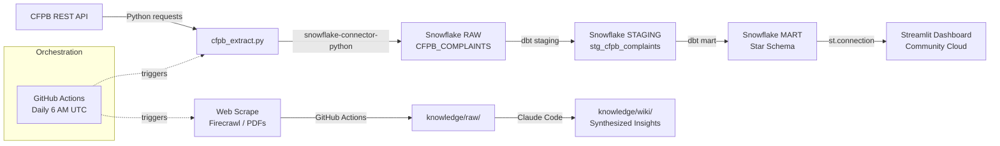

# Milestone 01 Design: Extract, Load & Transform
**Date:** 2026-04-26
**Due:** April 27, 2026 at 9:55 AM
**Approach:** Bottom-up — credentials first, then extract, then transform, then orchestrate

---

## 1. Overview

Build the full data pipeline from CFPB REST API → Snowflake RAW → dbt staging → dbt mart (star schema), automated via GitHub Actions. This milestone delivers four graded deliverables: the extraction script, the dbt project, the GitHub Actions workflow, and a pipeline diagram in the README.

**Central business question answered by this pipeline:** Which fintech products and companies are losing consumer trust, and why?

---

## 2. Credentials & Snowflake Setup

### Local `.env`
Copy `.env.example` to `.env` (gitignored) and fill in Snowflake credentials. The extraction script reads from environment variables, which works both locally (via `.env`) and in GitHub Actions (via repository secrets).

### Snowflake Schema Init (run once manually in a Snowflake worksheet)
```sql
CREATE DATABASE IF NOT EXISTS FINTECH_ANALYTICS;
CREATE SCHEMA IF NOT EXISTS FINTECH_ANALYTICS.RAW;
CREATE SCHEMA IF NOT EXISTS FINTECH_ANALYTICS.STAGING;
CREATE SCHEMA IF NOT EXISTS FINTECH_ANALYTICS.MART;
```

### GitHub Repository Secrets
Added via `github.com/<username>/fintech-consumer-analytics/settings/secrets/actions`:
- `SNOWFLAKE_ACCOUNT`
- `SNOWFLAKE_USER`
- `SNOWFLAKE_PASSWORD`
- `SNOWFLAKE_DATABASE`
- `SNOWFLAKE_WAREHOUSE`

---

## 3. Extraction Script (`extract/cfpb_extract.py`)

### Data Source
CFPB Consumer Complaint Database REST API — public, no API key required.
Base URL: `https://www.consumerfinance.gov/data-research/consumer-complaints/search/api/v1/`

### Date Range Strategy
- **Initial load:** Jan 1, 2023 → today (~3 years, ~300K records)
- **Daily incremental:** yesterday's complaints only (triggered by GitHub Actions at 6 AM UTC)
- The script checks `MAX(date_received)` in RAW: if null (table empty), runs full backfill from 2023-01-01; otherwise pulls complaints since that max date

### Product Filter
Requests filtered to four fintech-relevant categories:
- `Checking or savings account`
- `Credit card or prepaid card`
- `Money transfer, virtual currency, or money service`
- `Mortgage`

### Pagination
CFPB API supports up to 10,000 records per request. Script paginates via `from_index` offset until no records are returned.

### Target Table: `FINTECH_ANALYTICS.RAW.CFPB_COMPLAINTS`
| Column | Type | Source |
|---|---|---|
| `complaint_id` | VARCHAR | CFPB natural key |
| `date_received` | VARCHAR | Raw string, cast in staging |
| `product` | VARCHAR | |
| `sub_product` | VARCHAR | |
| `issue` | VARCHAR | |
| `sub_issue` | VARCHAR | |
| `company` | VARCHAR | |
| `state` | VARCHAR | |
| `zip_code` | VARCHAR | |
| `submitted_via` | VARCHAR | web, phone, referral, fax, email |
| `date_sent_to_company` | VARCHAR | |
| `company_response_to_consumer` | VARCHAR | |
| `timely_response` | VARCHAR | "Yes"/"No" raw string |
| `consumer_disputed` | VARCHAR | "Yes"/"No" raw string |
| `consumer_consent_provided` | VARCHAR | |
| `loaded_at` | TIMESTAMP | Added by script at load time |

### Deduplication
Before inserting a batch, the script fetches existing `complaint_id` values from RAW and skips any already present. This makes re-runs safe.

### Load method
Uses `snowflake-connector-python` with `executemany` for batch inserts. Credentials read from environment variables.

---

## 4. dbt Project (`dbt_project/`)

### Configuration
- **Profile name:** `fintech_analytics` (in `~/.dbt/profiles.yml`, gitignored)
- **Target database:** `FINTECH_ANALYTICS`
- All staging models: materialized as `view` in `STAGING` schema
- All mart models: materialized as `table` in `MART` schema

### Staging Model: `stg_cfpb_complaints.sql`
Source: `FINTECH_ANALYTICS.RAW.CFPB_COMPLAINTS`

Transformations only — no business logic:
- Rename columns to snake_case
- Cast `date_received` and `date_sent_to_company` to DATE
- Cast `timely_response` → `timely_response_flag` BOOLEAN (`'Yes'` = TRUE)
- Cast `consumer_disputed` → `consumer_disputed_flag` BOOLEAN (`'Yes'` = TRUE)
- Deduplicate on `complaint_id` (keep latest `loaded_at`)

### Mart Models (star schema, all in `MART` schema)

#### `dim_product`
| Column | Type |
|---|---|
| `product_key` | INT (surrogate PK) |
| `product_name` | VARCHAR |
| `product_category` | VARCHAR |

#### `dim_company`
| Column | Type |
|---|---|
| `company_key` | INT (surrogate PK) |
| `company_name` | VARCHAR |
| `company_response` | VARCHAR (most common response for this company) |

#### `dim_issue`
| Column | Type |
|---|---|
| `issue_key` | INT (surrogate PK) |
| `issue` | VARCHAR |
| `sub_issue` | VARCHAR |

#### `dim_geography`
| Column | Type |
|---|---|
| `geography_key` | INT (surrogate PK) |
| `state` | VARCHAR |
| `zip_code` | VARCHAR |

#### `dim_date`
| Column | Type |
|---|---|
| `date_key` | INT (surrogate PK, YYYYMMDD format) |
| `full_date` | DATE |
| `year` | INT |
| `quarter` | INT |
| `month` | INT |
| `month_name` | VARCHAR |
| `week_of_year` | INT |

Generated via a date spine from 2023-01-01 → current_date.

#### `fact_complaints`
| Column | Type |
|---|---|
| `complaint_key` | INT (surrogate PK) |
| `complaint_id` | VARCHAR (CFPB natural key) |
| `product_key` | INT (FK → dim_product) |
| `company_key` | INT (FK → dim_company) |
| `issue_key` | INT (FK → dim_issue) |
| `geography_key` | INT (FK → dim_geography) |
| `date_key` | INT (FK → dim_date) |
| `submitted_via` | VARCHAR |
| `timely_response_flag` | BOOLEAN |
| `consumer_disputed_flag` | BOOLEAN |
| `consumer_consent_provided` | VARCHAR |

### Schema Tests (`schema.yml`)
- `not_null` + `unique` on all surrogate PKs
- `not_null` on `fact_complaints.complaint_id`
- `accepted_values` on `submitted_via`: [web, phone, referral, fax, email]

### dbt Commands
```bash
python -m dbt run --project-dir dbt_project
python -m dbt test --project-dir dbt_project
```

---

## 5. GitHub Actions Workflow (`.github/workflows/extract_cfpb.yml`)

### Triggers
- `schedule`: daily at 6 AM UTC (`cron: '0 6 * * *'`)
- `workflow_dispatch`: manual trigger for testing

### Steps
1. `actions/checkout@v4`
2. `actions/setup-python@v5` with Python 3.11
3. `pip install requests snowflake-connector-python python-dotenv`
4. `python extract/cfpb_extract.py` — incremental load to Snowflake RAW
5. `pip install dbt-snowflake`
6. `python -m dbt run --project-dir dbt_project` — refresh staging + mart
7. `python -m dbt test --project-dir dbt_project` — fail workflow if tests fail

### Secrets Injection
All five Snowflake secrets injected as `env:` variables at the job level from GitHub repository secrets.

---

## 6. Pipeline Diagram (README)

Mermaid flowchart covering both the structured data path and knowledge base path (full architecture):



---

## 7. File Map

| File | Action |
|---|---|
| `.env` | Create from `.env.example` (manual — never committed) |
| `~/.dbt/profiles.yml` | Create (manual — gitignored, lives outside repo) |
| `extract/cfpb_extract.py` | Create |
| `extract/requirements.txt` | Create |
| `dbt_project/dbt_project.yml` | Create |
| `dbt_project/models/staging/stg_cfpb_complaints.sql` | Create |
| `dbt_project/models/staging/schema.yml` | Create |
| `dbt_project/models/mart/dim_product.sql` | Create |
| `dbt_project/models/mart/dim_company.sql` | Create |
| `dbt_project/models/mart/dim_issue.sql` | Create |
| `dbt_project/models/mart/dim_geography.sql` | Create |
| `dbt_project/models/mart/dim_date.sql` | Create |
| `dbt_project/models/mart/fact_complaints.sql` | Create |
| `dbt_project/models/mart/schema.yml` | Create |
| `.github/workflows/extract_cfpb.yml` | Create |
| `README.md` | Update — add pipeline diagram |

---

## 8. Execution Order (Approach A — Bottom-up)

1. Create `.env` with Snowflake credentials
2. Run Snowflake schema init SQL
3. Generate `~/.dbt/profiles.yml`
4. Write and run `cfpb_extract.py` locally — verify rows in `RAW.CFPB_COMPLAINTS`
5. Scaffold dbt project + all models
6. Run `python -m dbt run` locally — verify mart tables populate
7. Run `python -m dbt test` locally — verify all tests pass
8. Add GitHub repository secrets
9. Write `.github/workflows/extract_cfpb.yml`
10. Add pipeline diagram to README
11. Commit everything and push
12. Trigger workflow manually via `workflow_dispatch` — verify end-to-end in Actions
